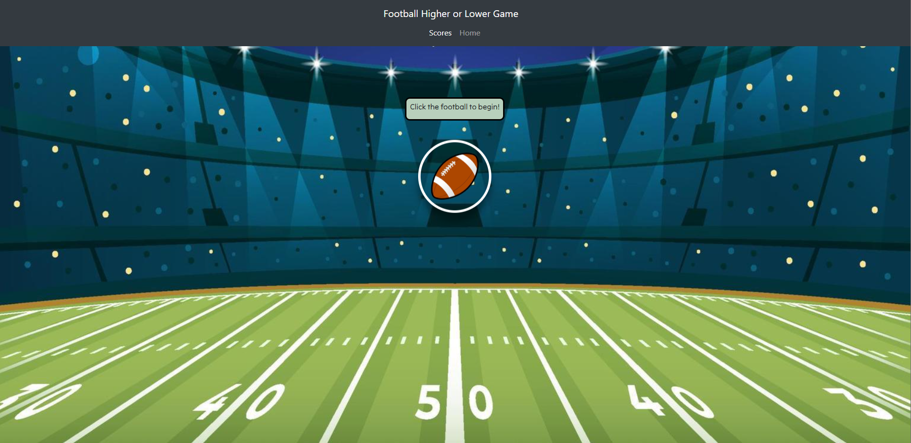

# group-project-1 - Higher-Lower Game: NFL Salaries
We created a game for a user to guess which two randomly generated NFL players have the higher salary. The game will end after 3 incorrect guesses, see how high of a score you can get! 

This data is pulled from [API-AMERICAN-FOOTBALL (1.4.7)](https://api-sports.io/documentation/nfl/v1). Additionally, we must give credit to [Mario Duarte](https://codepen.io/MarioDesigns/pen/woJgeo) who helped provide reference code for our floating football on the landing page.

## Team Members w/GitHub Links:
- [Leah Tillman](https://github.com/lrltillman)
- [Grant Mitchell](https://github.com/GrantMitchell24)
- [Samiye Ahsan](https://github.com/samiyeahsan)
- [Ben Pavlis](https://github.com/bpavlis)

## Final Screenshots
  
  

  

## Links
[GitHub](https://github.com/bpavlis/group-project-1)

[GitHub Pages](https://bpavlis.github.io/group-project-1-personal/)